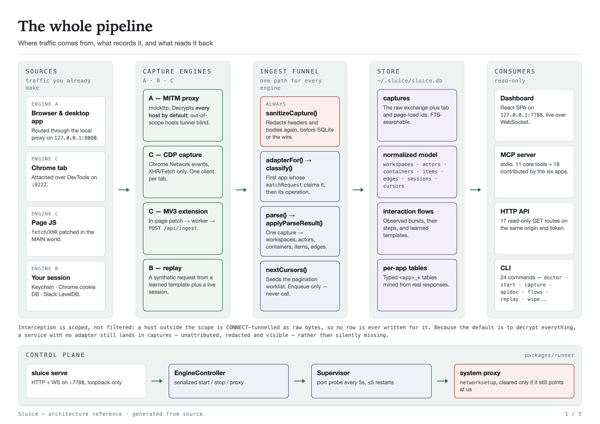
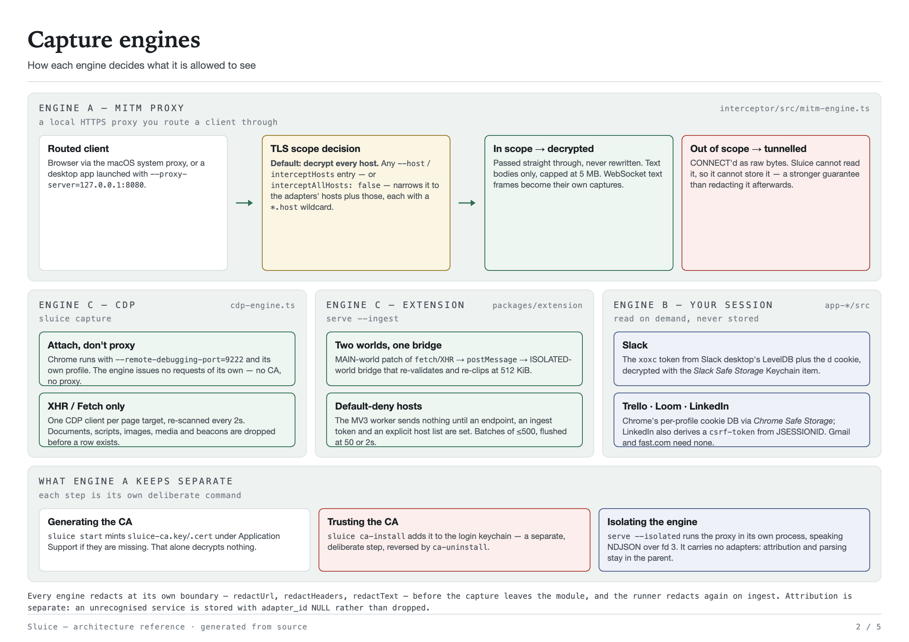
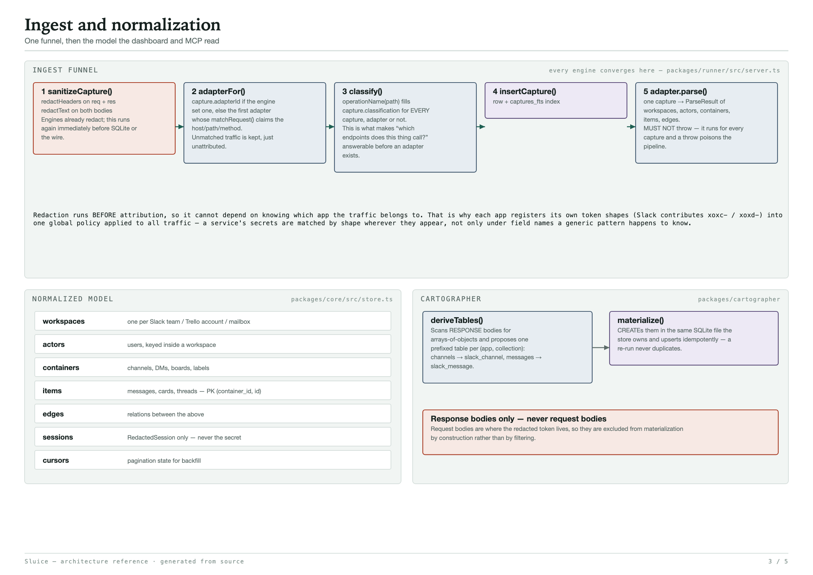
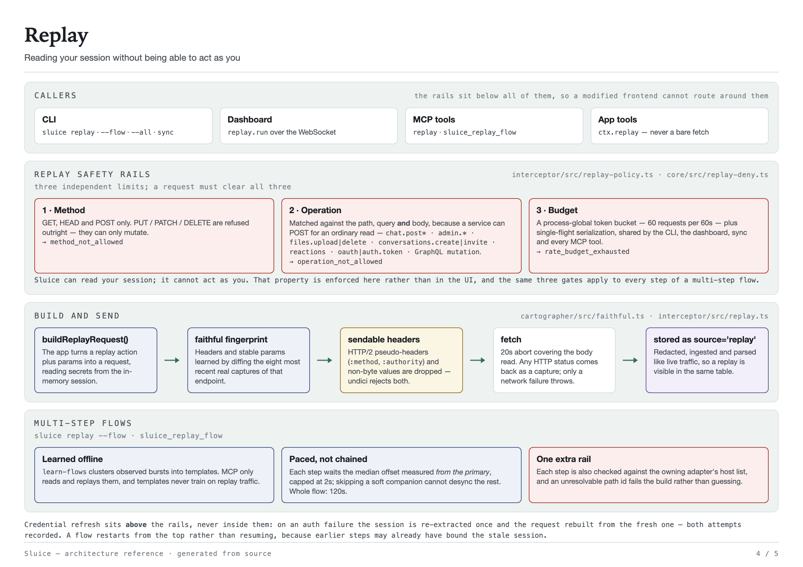
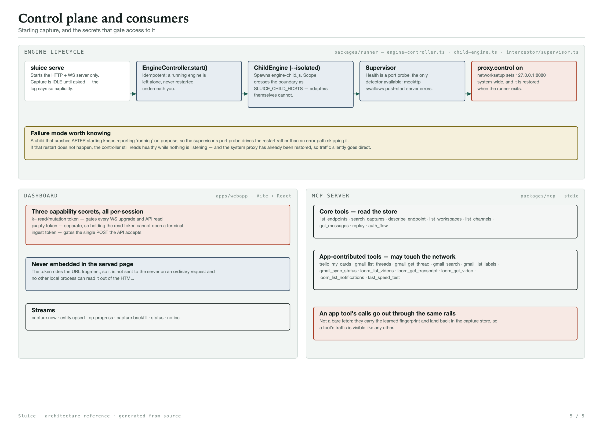

# Sluice

> Sluice is a local traffic recorder for the SaaS accounts you are already signed
> into. It captures what your own clients call, on your machine only, and hands it
> to an agent read-only — for developers who cannot get an app registration approved.

You work somewhere that will not let you create a Slack app or issue a bot token,
but you still need programmatic access to *your own* data. The official paths run
through workspace-admin approval. Sluice reads the session you already have, and
nothing leaves the machine.

## Isn't this what malware does?

It uses some of the same mechanisms, so the honest answer is: judge it on the
mechanisms, not on the promise. Four differences that are checkable in the source
rather than taken on faith.

| | A credential stealer | Sluice |
|---|---|---|
| Where data goes | Out, to someone else | Nowhere. There is no egress path in the codebase — no telemetry, no cloud, no update check, no analytics |
| What it does with your session | Exfiltrates it | Holds it in the memory of the process that read it, never writes it to disk. There is deliberately no credentials table in the schema |
| What it can do to your account | Anything you can | Reads only. `GET`/`HEAD`/`POST`, a write/admin denylist matched against path, query *and* body, and a 60-request-per-60-second budget — enforced below every caller, so the UI cannot route around it |
| Who it works for | Whoever installed it | Only accounts already signed in on this machine. It cannot authenticate as anyone else, and there is a standing decision never to add detection evasion |

### Audit this yourself

Do not take the table on trust. Paste this at an agent with the repo open:

```
Read github.com/YasserShkeir/sluice and verify or refute these five claims:
1. No code path sends captured data to any remote host except the service it
   was captured from.
2. Credentials are never written to SQLite — check packages/core/src/schema.ts
   for any column that could hold one.
3. Replay cannot issue a mutating request — check
   packages/interceptor/src/replay-policy.ts and packages/core/src/replay-deny.ts.
4. Redaction runs before a capture is stored — check the ingest funnel in
   packages/runner/src/server.ts.
5. The dashboard's HTTP API is read-only — check packages/runner/src/api.ts.
Report anything you cannot verify.
```

[`SECURITY.md`](./SECURITY.md) documents the gaps too, including one it calls
"the sharpest gap in the current design".

## What Sluice never does

- **Never sends captured data anywhere.** No telemetry, no crash reporting, no
  update check. The only outbound requests are your own client's, replays to the
  service the data came from, and two diagnostic probes if you run `doctor --net`.
- **Never writes a credential to disk.** The store has no column for one; only a
  redacted descriptor naming credential *kinds* is persisted.
- **Never issues a mutating request.** 3 methods allowed, 12 denylist patterns
  matched against path, query and body, 60 requests per 60 seconds, single-flight.
  Every step of a multi-step flow pays the same three gates.
- **Never modifies traffic.** The proxy is read-only passthrough — no breakpoints,
  no rewriting, no injection. Every request and WebSocket is `thenPassThrough()`'d
  with no transforms
  ([`mitm-engine.ts`](./packages/interceptor/src/mitm-engine.ts)).
- **Never evades detection.** A standing decision, not an oversight: no
  fingerprint spoofing, no rate-limit dodging, no pinning bypass. If a service can
  tell Sluice is replaying, that is working as intended.
- **Never authenticates as anyone but you.** There is no login flow and no way to
  supply someone else's account. It reads credentials your OS already holds for
  you, and the only prompts you will see are macOS's own.

Sluice only ever talks to accounts you are already signed into, on hardware you
control. Whether that is permitted is between you and whoever runs the service —
check your workplace policy, and prefer a workspace-issued API token whenever one
is actually available. The rails above are written down in
[scope and limits](./docs/public/scope-and-limits.md).

## Quickstart (macOS)

Start with the mode that costs you nothing: no certificate, no Keychain prompt,
no system proxy.

```bash
git clone https://github.com/YasserShkeir/sluice && cd sluice
pnpm install                 # builds better-sqlite3, classic-level, node-pty, esbuild
pnpm sluice doctor           # checks your environment — reads no secrets
pnpm webapp:build            # builds the dashboard
pnpm sluice capture          # launches a dedicated Chrome and records its API calls
```

That is the whole install. `capture` watches Chrome through the DevTools Protocol
— the same interface the Network tab uses — so it sees exactly what you could
already see by pressing F12, and nothing else. Browse normally; the dashboard URL
is printed with a token in its fragment.

Already have captures and just want to look at them: `pnpm sluice serve`.

<details>
<summary><b>The proxy path</b> — more coverage, and a real trust cost. Read this before running it.</summary>

<br>

`sluice start` runs a local HTTPS proxy so it can record desktop apps too, not
just Chrome. That requires installing a certificate authority you generate, which
is a genuine security decision, so here is the whole of it:

**The risk.** Any process that trusts that CA can have its TLS decrypted by
anything holding the matching private key. The key lives at
`~/Library/Application Support/Sluice/ca/sluice-ca.key` with mode `0600`. If
someone steals that file, they can impersonate any site to your machine.

**The mitigation.** The CA is generated on your machine on first run and never
leaves it — it is not shared between installs, so no other Sluice user can
intercept you. Generating it and *trusting* it are separate steps: starting the
engine only creates the files, and `sluice ca-install` is the deliberate command
that adds it to your login keychain.

**The residual risk.** While the proxy runs it decrypts **every host** by default,
not only the ones an adapter claims — so unrelated traffic is decrypted and
stored. It also listens on **every network interface**, not just loopback, because
the underlying library offers no way to narrow it. Scope with `--host`, keep
sessions short, and do not run it on a network you do not trust. Both are
documented in [`SECURITY.md`](./SECURITY.md).

**Who should not do this.** On a managed or employer-owned device, on a shared
machine, or on an untrusted network — use `sluice capture` instead. It needs no CA
at all.

```bash
pnpm sluice ca-install       # the deliberate step: trust the CA (asks for your password)
pnpm sluice start            # run the proxy; prints how to route a desktop app through it
pnpm sluice proxy on         # optional: point the whole system at it (macOS)

pnpm sluice ca-uninstall     # undo the trust, any time
pnpm sluice wipe --all       # panic button: delete the capture DB, the CA and the Chrome profile
```

</details>

**Status: working MVP.** Six app plugins (Slack, Trello, Gmail, Loom, LinkedIn,
fast.com), three capture engines, an MCP server, a dashboard and a 24-command CLI.
~770 tests, lint, typecheck and the packaging build run green in CI. Nothing is
published to npm yet — install from a clone as above.

---

## What is this?

Sluice records the API calls your own, already-authenticated clients make,
reconstructs the service's structure from them (channels, DMs, users, boards,
threads), and lets you read and export it — through a web UI, a CLI, or an MCP
server your agent can call. Slack was the first adapter; six ship today, and the
architecture generalizes to Notion, Linear, Jira, Discord and anything else
through pluggable app packages.

**What it is not.** Not a personal web archive or a search engine over pages you
have read — it captures the calls your clients *make*, not the documents you
*see*. Not a traffic debugger: it does not breakpoint, rewrite or mock anything.
Not a scraper: it reads accounts you are signed into, and cannot authenticate as
anyone else. See [Prior art](#prior-art) for the neighbours it is most likely to
be confused with.

## How it works (four capture modes)

| Mode | What it can read | What it can never do | Trade-off |
|---|---|---|---|
| **C — Browser CDP** *(start here)* | XHR/Fetch in a Chrome it launches — the same traffic the Network tab shows you | Touch a desktop app, or see anything outside that browser | Chrome only, and a separate profile you sign into |
| **C — MV3 extension** | `fetch`/`XHR` on hosts you explicitly name, in your normal profile | Capture anything on a host you did not name; see WebSockets | Default-deny, so it does nothing until configured |
| **A — MITM proxy** | Every host routed through it, desktop apps included | Modify a single byte — it is read-only passthrough | Needs a CA you trust, decrypts everything by default, and listens on every interface |
| **B — Credential extract + replay** | Whatever your session can, on demand — including pages you never opened | Issue a write: 3 methods, 12 denylist patterns, 60/60s | Reads your Keychain / cookie DB; macOS only |

All of them normalize into one data model and stream into a local web app that is
part traffic inspector (à la Charles/mitmweb/Proxyman), part data explorer. Only
Engine B reaches for data you have not already seen, and it is the one wearing the
most rails.



Every engine converges on **one ingest funnel**, so redaction, attribution and
parsing happen in exactly one place no matter how a capture arrived.

<details>
<summary><b>Architecture in detail</b> — four more diagrams</summary>

<br>

**Capture engines — how each one decides what it is allowed to see.** Engine A
(MITM) **decrypts every host by default** while capture is running. Pass `--host`
(repeatable) or `interceptHosts` — or set `interceptAllHosts: false` — to scope TLS
termination; hosts outside that scope are CONNECT-tunnelled as raw bytes with no row
written. Engine C's CDP path captures XHR/Fetch on any host; the extension is
default-deny and captures nothing until you name hosts. Adapter `matchRequest` only
decides *attribution* — an unknown service is still stored, unattributed.



**Ingest and normalization.** Redaction runs *before* attribution, which is why each
app registers its own token shapes into one global policy applied to all traffic.



**Replay.** Three independent limits — method, operation, budget — sit below every
caller, so a modified frontend or a creative tool argument cannot route around them.



**Control plane and consumers.** The three run modes, the engine lifecycle, the three
per-run capability secrets, the MCP tool surface and the read-only HTTP API.



All five as one printable sheet: [`assets/architecture/sluice-architecture.pdf`](assets/architecture/sluice-architecture.pdf).
The diagrams are generated from checked-in HTML sources — edit
`assets/architecture/src/*.html` and run `node scripts/diagrams.mjs` to rebuild
both the PNGs and the PDF. Chrome is the only dependency.

</details>

- 📄 **[Contributing →](./CONTRIBUTING.md)** — setup, the rules that matter, and how to add a service
- 📄 **[Security & privacy →](./SECURITY.md)** — read this one

## Security & scope — read this

Sluice is designed to be trustworthy because it's boring about data:

- **100% local.** Captured traffic and credentials never leave your machine. No telemetry, no cloud.
- **Local session only.** It reads credentials your OS already holds for you on this machine.
- **Secrets stay in memory.** Session tokens and cookies live only in the process that extracted them and are never written to disk. The capture store lives outside the repo at `~/.sluice/sluice.db`, and `.gitignore` covers `.sluice/`, `captures/` and `*.sqlite*` for the cases where you point it somewhere else. (Credentials are ordinary JS strings and cannot be reliably wiped — see [`SECURITY.md`](./SECURITY.md#known-limits-what-is-not-guaranteed).)
- **Broad by default.** While Engine A is running it decrypts **every host** routed through the proxy, not just the ones an adapter claims. That is deliberate — a service with no adapter is still worth capturing — but it means unrelated traffic is decrypted and stored. Scope it with `--host`, `interceptHosts`, or `interceptAllHosts: false`, and keep proxy sessions short. `sluice capture` (browser CDP) decrypts nothing.
- **The proxy listens on every interface.** The dashboard and API are loopback-only, but the MITM proxy is not — `mockttp` gives no way to narrow it. Do not run `sluice start` on a network you do not trust. See [`SECURITY.md`](./SECURITY.md#the-mitm-proxy-listens-on-every-interface-not-just-loopback).
- **Replay is read-only.** Mutating verbs and write/admin operations are blocked below every caller, with a shared rate budget.
- **Explicit consent.** Trusting the local CA is a deliberate, reversible step you run yourself.
- **Nothing expires by default.** Set `retentionDays` / `maxCaptures`, or run `sluice prune` / `sluice wipe`.

When a workspace-issued API token is available, prefer that path. Sluice is for
working with data already reachable from your local session.

## Commands

`sluice <command> [options]` — 24 commands. Run `pnpm sluice <command> --help` for
per-command options.

**Capture**

```
doctor          Check the local environment (Node, app sign-in, proxy engine, DB). No secrets.
serve           Start the loopback web UI + WS server. The engine starts idle; start it from the UI.
start           Like serve, plus the MITM proxy engine running immediately.
capture         Passively capture browser API traffic via Chrome DevTools (no proxy/CA/Keychain).
proxy           Toggle the macOS system web proxy: sluice proxy <on|off|status>.
ca-install      Generate + trust Sluice's local CA (for MITM capture).
ca-uninstall    Remove trust for Sluice's local CA.
```

**Credentials and replay**

```
extract-token   Read your local session token + cookie; print a REDACTED summary only.
sync            Reconstruct structure for ALL (or one) workspace via the service's own API.
replay          Run one replay action by id, --flow <template>, or --all to drain the cursor worklist.
auth            Map how a service authenticates you, from captured traffic. No secrets.
```

**Understand what you captured**

```
build-db        Materialize per-app tables from captures.
apidoc          Render a Markdown API catalog from captured traffic (scope it with --host).
flows           List / show / pin interaction flows and learned templates.
learn-flows     Cluster captures into flows and refresh multi-step templates.
export          Dump a container's items: json | ndjson | markdown | sqlite.
record          Dump captures as NDJSON for the mock runner (credential-free replay).
mock            Replay a recorded NDJSON fixture through the real ingest path.
```

**Manage the runner and the store**

```
adapters        List installed apps: hosts, credential source, replay actions, MCP tools.
app             Enable/disable installed apps: sluice app <list|enable ID|disable ID>.
status          Is a runner serving? Report pid/port/uptime and store size.
stop            Ask a running runner to shut down (--force to SIGKILL).
prune           Delete old captures: --days N and/or --max-rows N [--vacuum].
wipe            THE PANIC BUTTON: delete the capture DB; --all also removes the CA + Chrome profile.
```

`--db PATH` (default `~/.sluice/sluice.db`) and `-h` work almost everywhere.
`--port N` (default 7788) applies to the four commands that bind a port — `serve`,
`start`, `capture` and `mock`. `--config PATH` is accepted by `serve`, `start`,
`mock`, `adapters`, `status` and `auth` only — elsewhere it is an unknown-option
error, because each command parses its own flags strictly. Whether a command
consults the discovered config file at all depends on whether it resolves a DB
path or a port; `proxy`, `ca-install`, `ca-uninstall`, `stop` and `app` do not.

`serve` also carries the flags `start` does not: `--isolated` (run the MITM engine in
its own process), `--ingest` (enable the extension's `POST /api/ingest` endpoint) and
`--terminal` (an embedded Claude Code session in the dashboard, behind its own
capability secret — see [`SECURITY.md`](./SECURITY.md)).

## Configuration

Optional. Sluice reads the nearest `sluice.config.json` or `.sluicerc.json`, walking
up from the CWD, then `~/.sluice/config.json`. `--config PATH` overrides both, on the
six commands that accept it. A malformed config is a hard error rather than a silent
fallback — running with settings you believe you overrode is worse than not starting.

```jsonc
{
  "db": "~/work/sluice.db",        // SQLite path
  "port": 7788,                    // HTTP + WS port
  "proxyPort": 8080,               // MITM proxy port (sluice start)
  "cdpPort": 9222,                 // Chrome remote-debugging port (sluice capture)
  "retentionDays": 14,             // drop captures older than this at serve/start
  "maxCaptures": 50000,            // keep at most this many
  "interceptHosts": ["slack.com"], // extra hosts to decrypt when TLS scoping is on
  "interceptAllHosts": false,      // false = scope TLS termination; default is true
  "maxBodyBytes": 5000000          // RESERVED — not threaded through; engines hard-cap at 5,000,000 chars
}
```

Most settings also have a CLI flag, and where both exist the flag wins.
`retentionDays`, `maxCaptures`, `maxBodyBytes` and `interceptHosts` are config-only,
and `--host` values are **added to** `interceptHosts` rather than replacing them.

Two settings behave differently and are worth knowing:

- **`interceptAllHosts` defaults to `true`.** Any `--host`/`interceptHosts` entry, or
  an explicit `false`, switches Engine A to scoped TLS termination.
- **The `adapters` allow-list is read only from `~/.sluice/config.json`**, never from a
  project-local file — a repo you clone must not be able to widen what gets decrypted.
  Use `sluice app enable|disable <id>`, which writes that file.

## HTTP API

The runner exposes a read-only JSON API on the same loopback origin, gated by the read
token (`?token=…` or `Authorization: Bearer`) plus a loopback `Host` and, when one is
sent, a loopback `Origin`. Any non-GET request gets 405.

```
GET /api/status                      GET /api/captures?limit&app&host&tab&ids&since
GET /api/storage                     GET /api/captures/search?q
GET /api/adapters                    GET /api/captures/:id/body
GET /api/sessions                    GET /api/captures/:id/entities
GET /api/workspaces                  GET /api/containers?workspaceId
GET /api/actors                      GET /api/items?containerId
GET /api/apidoc[?format=markdown]    GET /api/tables
GET /api/flows[?app&source&q]        GET /api/tables/:name?limit&offset&orderBy
GET /api/flow-templates[?app&primaryKey&q]
```

`/api/tables` is the Cartographer's output — the typed per-app tables derived from
real responses. Table and column names are validated against the live schema before
use, so only materialized `<app>_*` tables are reachable.

The one exception to "read-only" is `POST /api/ingest`, the MV3 extension's capture
endpoint. It exists only under `sluice serve --ingest`, is gated by its own separate
secret, and returns 404 `ingest_disabled` otherwise.

## MCP server

Sluice exposes its captured data — and each app's tools — to Claude over MCP. Build
once, then register the bundle:

```bash
pnpm build
claude mcp add sluice -- node /path/to/sluice/packages/mcp/dist/cli.js
```

(In dev, before a build: `claude mcp add sluice -- pnpm --dir /path/to/sluice exec tsx packages/mcp/src/cli.ts`.)

The server advertises **29 tools**: 11 core plus 18 contributed by the installed apps
(gmail 5, linkedin 7, loom 4, trello 1, fast 1; Slack contributes none). Nine of the
core tools read the store — workspaces, containers, items, endpoints, capture search,
endpoint shapes, the auth map and the two flow readers. Two make live requests:
`replay` and `sluice_replay_flow`, both through the same safety rails as every other
caller. App-contributed tools get a nine-method read-only projection of the store, so
a tool cannot write or reach raw SQLite.

## Repo layout

```
packages/core          @sluice/core          types · normalized model · SQLite store · WS types · redactor   (Apache-2.0)
packages/protocol      @sluice/protocol      zod validation of client WS frames, browser-safe                (Apache-2.0)
packages/adapter-sdk   @sluice/adapter-sdk   coercion helpers · capture fixtures · scrubber · conformance     (Apache-2.0)
packages/interceptor   @sluice/interceptor   MITM engine (mockttp) · CDP engine · replay + rails · supervisor
packages/cartographer  @sluice/cartographer  API map · per-app tables · faithful + multi-step flow templates
packages/apps          @sluice/apps          the installed-apps registry (the one place apps are named)
packages/app-slack     @sluice/app-slack     Slack: adapter · parser · Keychain + LevelDB credentials
packages/app-trello    @sluice/app-trello    Trello: adapter · Chrome-cookie credentials · MCP tool
packages/app-gmail     @sluice/app-gmail     Gmail: positional-array sync API · thread/label MCP tools
packages/app-loom      @sluice/app-loom      Loom: GraphQL adapter · cookie credentials · transcript MCP tool
packages/app-linkedin  @sluice/app-linkedin  LinkedIn: Voyager adapter · jobs/messaging · cookie credentials
packages/app-fast      @sluice/app-fast      fast.com: credential-free adapter · speed-test MCP tool
packages/mcp           @sluice/mcp           the `sluice-mcp` stdio MCP server
packages/runner        @sluice/runner        the `sluice` CLI + loopback HTTP/WS server
packages/cli           sluicejs              bare-name launcher — no logic of its own
packages/extension     @sluice/extension     Engine C's MV3 browser extension (loaded unpacked)
apps/webapp            @sluice/webapp        Vite + React dashboard (overview · traffic · apps · explore · replay · data)
```

## Build

```bash
pnpm build     # bundles the dashboard, the CLI, the isolated engine child and the MCP server
node packages/runner/dist/cli.js doctor
```

`pnpm build` runs the Vite build, then esbuild over three entrypoints:
`packages/runner/dist/cli.js` (the `sluice` binary), `packages/runner/dist/engine-child.js`
(the `serve --isolated` child process) and `packages/mcp/dist/cli.js` (the `sluice-mcp`
binary). All three run under plain `node` — no `tsx`, no workspace. The dashboard is
copied in alongside the CLI bundle, so a published package would serve it without the repo.

Native addons (`better-sqlite3`, `classic-level`, `node-pty`) plus `chrome-remote-interface`,
`ws`, `zod` and the MCP SDK are left external and declared as runtime dependencies —
bundling a native addon breaks its `.node` binding lookup. **`mockttp` is the exception
and is deliberately bundled**: its CJS build `require()`s ESM-only `get-port`, which
throws under plain Node, and bundling resolves that at build time. It lands in its own
lazily-loaded ~12 MB chunk, so every command except `start` pays nothing for it.

## Platform support

macOS is the primary target. Credential extraction, CA trust (`ca-install`) and
system-proxy control (`sluice proxy`) are macOS-only. Everywhere else the dashboard,
the HTTP API, the MCP server, `sluice capture` (CDP) and replay via pasted
`--token`/`--cookie` work anywhere Node 20+ runs — though paste-in is implemented for
Slack only today. CI runs on Linux and Node 20.

## Prior art

Sluice sits in a crowded neighbourhood and borrows from most of it. The honest
summary is that **local capture exposed to an agent over MCP is no longer
novel** — Proxyman, Burp and Requestly all ship MCP servers now. What is
narrower is the combination Sluice actually offers: *normalized entities* above
the HTTP layer, and *replay behind safety rails* that can fetch what you have
not already seen.

| Project | What it is | What separates Sluice |
|---|---|---|
| [mitmproxy](https://mitmproxy.org) | MIT, 16 years, the reference local TLS-intercepting proxy. Engine A's mechanism, in Python | Its data model stops at the flow — request bytes, response bytes. Sluice's continues into workspaces, actors, containers, items and edges. mitmproxy will happily replay a captured `DELETE`, unthrottled; Sluice's replay is method-allowlisted, denylisted and rate-budgeted |
| [HTTP Toolkit](https://httptoolkit.com) | AGPL product over permissive libraries. **Sluice's Engine A is built on `mockttp`, HTT's own interception library** | A debugging workbench: nothing is persisted, and it can breakpoint and rewrite traffic. Sluice persists and normalizes, and never modifies a byte |
| [slackdump](https://github.com/rusq/slackdump) | AGPL, Go. Borrows your own Slack session, calls Slack's undocumented client APIs, stores to SQLite, ships an MCP server | The closest single neighbour. For Slack alone it is more capable than Sluice. Sluice is the generic seam — one adapter contract, one redactor, one set of replay rails, across six services |
| [Hister](https://hister.org) | AGPL, Go, by the SearX author. A personal search engine over pages and files you keep | Indexes rendered documents; Sluice indexes API exchanges. Genuinely complementary — Hister indexes the page, Sluice captures the calls that page made |
| [HPI](https://github.com/karlicoss/HPI) / [Promnesia](https://github.com/karlicoss/promnesia) | MIT. Unified, offline, typed access to your own digital trace | The same stated goal with no capture mechanism — HPI reads exports you already possess. Its author also argues *against* normalizing personal data into a database, which is worth reading before defending this one |
| [screenpipe](https://github.com/mediar-ai/screenpipe) | Source-available. Local capture → SQLite + FTS → MCP | The same shape on a different substrate: it records the rendering (pixels, audio, accessibility tree); Sluice records the JSON the client already fetched, so it gets typed records and stable ids for free |

Two things Sluice takes directly and gratefully: `mockttp` from HTTP Toolkit, and
the shape of the endpoint catalog from
[mitmproxy2swagger](https://github.com/alufers/mitmproxy2swagger).

## Support

Sluice is unfunded and maintained by one person, and will keep being built either
way — this is not a business and nothing here is gated behind paying. Adapters,
engine work and macOS-version breakage all cost time; sponsorship pays for that
time and nothing else.

- **GitHub Sponsors** — [github.com/sponsors/YasserShkeir](https://github.com/sponsors/YasserShkeir) (recurring, counts toward your GitHub profile)
- **Donate page** — [yasser-shkeir.com/donate](https://www.yasser-shkeir.com/donate)

Direct Stripe checkout, if you'd rather skip a page:

| One-time | Monthly |
|----------|---------|
| [$5](https://buy.stripe.com/6oUfZbgh17Km5xQ2HzcMM00) · [$10](https://buy.stripe.com/bJe00d8Oz4ya8K21DvcMM01) · [$25](https://buy.stripe.com/00wfZb5Cn7Km8K21DvcMM02) · [$50](https://buy.stripe.com/aFa14h7Kv0hU1hAfulcMM03) | [$5/mo](https://buy.stripe.com/8x2eV76Gr9Su1hAci9cMM04) · [$15/mo](https://buy.stripe.com/28EeV7e8TaWy2lE5TLcMM05) · [$50/mo](https://buy.stripe.com/bJe8wJ7Kvc0C7FY2HzcMM06) |

Sponsorship buys no support contract, no roadmap influence, and no license exception — the split license above applies to sponsors and non-sponsors identically. Nothing in the tool phones home for this: these are plain links in a Markdown file, and no Sluice binary or command fetches them.

## License

Split-licensed: **`packages/core`, `packages/adapter-sdk` and `packages/protocol` are
Apache-2.0** (permissive, so anyone can build adapters on the model) and **everything
else is AGPL-3.0-or-later** (a hosted derivative must publish source; running it
locally carries no obligations). See [`LICENSING.md`](./LICENSING.md).

---

*Working name; subject to change.*
